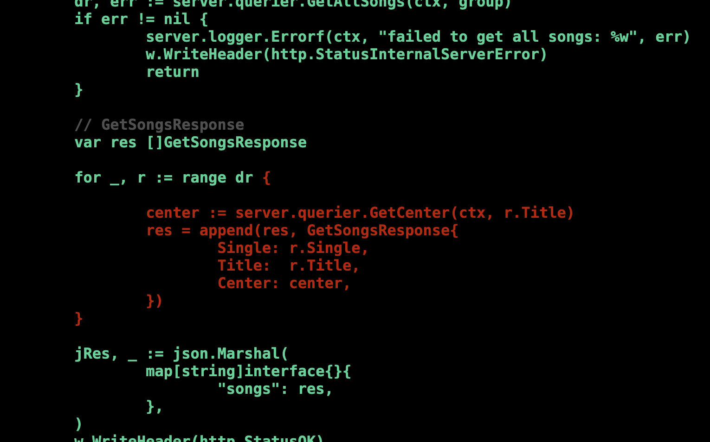

## sec 1

- go の目指すところ
  - Java や c++ のような静的型付け言語で、巨大なシステムでもスケールする
  - 動的型付け言語のように生産性が高く、可読性も高い
  - IDE を必要としない
  - ネットワーク処理が多重実行できる
- Go の活用場所
  - CLI
  - TUI
    - GUI のようなユーザーインターフェースを提供
  - Web アプリケーション
- いいところ
  - 標準で UTF-8 をサポート
  - マルチプラットフォーム
  - 並行処理の扱いやすさ
  - ストリーム指向！
    - io interface など
  - シングルバイナリ
    - 実行環境と開発環境で同じバイナリを使える
- Why Go?
  - コンパイルの速さ
  - レビューのしやすさ
    - gofmt
  - パッケージの公開の簡単さ！
  - libc 非依存！
    - c で開発された言語や、ライブラリが c で開発されている場合、それらは libc に依存している！
    - 実行ファイル生成に c が必要 → クロスコンパイルの難易度が上がる

## sec 2

環境構築

- バージョン管理ソフトウェア (goenv など)
  - 各ソフトウェアに対して必要なランタイムが固定されていないと動作しない or 動作の保証がないという問題を解決するには有効
  - Go のようにビルドされてすでに静的にリンクされた実行ファイルに対してはほぼ意味がない
  - 下位互換性: The Go 1 Compatibility Rules

## sec 3

- Go の特徴
  - GC がある
  - 静的な型を使う
  - ポインタを使う
  - 三項演算子はない
  - 継承はない
  - 例外はない
- 命名規則
  - 名前の長さはその情報の中身を越えるべきではない
  - グローバルな名前は相対的により多くの情報を伝えなければならない
  - 全てを名前で伝える！
- レイアウト
  - 実行ファイルを提供する場合は cmd 配下に実行ファイル名のディレクトリ + main.go

## sec 4

``` sh
$ python
>>> import this
The Zen of Python, by Tim Peters

Beautiful is better than ugly.
Explicit is better than implicit.
Simple is better than complex.
Complex is better than complicated.
Flat is better than nested.
Sparse is better than dense.
Readability counts.
Special cases aren't special enough to break the rules.
Although practicality beats purity.
Errors should never pass silently.
Unless explicitly silenced.
In the face of ambiguity, refuse the temptation to guess.
There should be one-- and preferably only one --obvious way to do it.
Although that way may not be obvious at first unless you're Dutch.
Now is better than never.
Although never is often better than *right* now.
If the implementation is hard to explain, it's a bad idea.
If the implementation is easy to explain, it may be a good idea.
Namespaces are one honking great idea -- let's do more of those!
```

- Zen of Python のうち、以下の2つを重視している
  - Explicit is better than implicit
  - Simple is better than complex
- blank import
  - db のドライバの register など

``` sh
go install golang.org/x/tools/cmd/stringer@latest
```

- NDJSON: Newline Delimited JSON
- path vs filepath
  - path: URL などの仮想的なパスの操作
  - filepath: 物理的なパス
- filepath.Walk よりも、filepath.WalkDir の方がパフォーマンスが良くなる！
  - filepath.Walk は検索した各エントリに対して os.Lstat を呼び出す実装のため
- context package
  - cancel, timeout
- build constraints
- cgo: go から c 言語を扱うための仕組み！
- デフォルト引数
  - 可変個引数
  - Functional Options Pattern
- internal パッケージ
  - 意味はわかる
  - 使ってる例がわからない
  - ライブラリ的なのを作らないと分からないか
    - 複雑なライブラリ作って、その中でパッケージを切るけど、公開するのはトップのやつ（handler 的な部分）のみ、って感じかな
- 埋め込み
  - 委譲としての継承を実現してる！

``` sh
# モジュールを指定して run することもできる！
go run github.com/mattn/longcat@v0.0.4
```

### メモ

- 移譲と継承について
  - 委譲ってのは別クラスに切り出してメンバー変数で持つだけ、のものかな
    - わざわざ名前つけんなや

## sec 5

- routing
  - func.Handle, func.HandleFunc は引数の違いのみで、キャスト可能
- Go のメソッド呼び出しは、第一引数にレシーバを持った関数の呼び出しと同義！！

### SMTP

- gmail: smtp.gmail.com
  - https://support.google.com/a/answer/176600?hl=ja
- 2 段階認証プロセス > アプリ パスワード

## sec 6

### goroutine

- **goroutine が効果を出すのは I/O が絡むケース！**
- メモリや CPU のみを使う計算処理を並行処理しても、それほど効果を発揮しない
- goroutine は並行かつ並列
  - CPU の中で最適なスレッドを生成し、その中で goroutine をぶん回す
    - c などでナイーブに 100 並行して 100 スレッドとか立てると、コンテキストスイッチの多発により高負荷になってまう
  - 並行処理をたくさん行う必要があるケースでは、CPU コアを有効に活用できる処理が簡単にかける！

### patterns

- ジェネレータ
- 合流処理
- 先着処理
- タイムアウト処理
- スロットリング
  - サーバー側の負荷を考えて、並行でアクセスしすぎは良くない
  - バッファ付き chan が、バッファを超える要素を送信しようとした時にブロックする特性！

## sec 7

- テストの目的
  - 品質を保証するため
  - 安全に壊すため
    - リファクタががんがん可能
- パッケージ名の指定
  - どっちでもいいっぽい
    - 同じ名称
    - 別の名称
- テストデータ
  - testdata というディレクトリに置くことが多い
    - いろんなツールでも無視されるようになってる
      - 同じように `.` や `_` で始まるファイル・ディレクトリも無視するようになってる

### カバレッジ

テストのカバレッジの部分を html として表示する！

``` sh
go test -v -cover -coverprofile=cover.out ./...
go tool cover -html=cover.out -o cover.html
```

以下のようにカバーできてない範囲を赤で表示してくれる。



testing パッケージには色々と便利な関数が用意されている！

``` go
t.TempDir()
t.Setenv()
```

### Fuzzing

- どういったケースで使おうかな
  - セキュリティの問題が懸念される場合
  - 複雑な処理がある場合
  - 大量のデータが扱われる場合
  - プログラムのバグを発見するため

### memo

- テストは一回限りではなく繰り返し行うことが重要
- 新しい機能を足した際にテストも足すよ

## sec 8

- 言語標準でテストスイートだけでなくベンチマークも用意してるのは珍しいのでは？
- 推測するな、計測せよ
  - Rob Pike (Go の生みの親の1人)
  - > Bottlenecks occur in surprising places, so don't try to second guess and put in a speed hack until you've proven that's where the bottleneck is.

### benchmark

``` go
package something

func BenchmarkDoSomething(b *testing.B) {
    for i := 0; i < b.N; i++ {
        DoSomething()
    }
}
```

``` sh
go test -bench DoSomething
```

### pprof

サーバーの場合

サーバーの場合は "net/http/pprof" をブランクインポートするだけ

``` go
	// 別のごるーちんで起動
	go func() {
		log.Println(http.ListenAndServe("localhost:6060", nil))
	}()
```

``` sh
curl -s http://localhost:6060/debug/pprof/profile > cpu.prof
# この間にアクセスする！
go tool pprof -http=:7777 cpu.prof 
```

## sec 9

- FTS4: Full Text Search version 4
- urfave/cli を最もよく使ってるみたい、今は
- TUI: Text User Interface
  - 端末の制御
  - Go は内部エンコーディングが UTF-8 で、異なるプラットフォームに適応させやすい
  - olekukonko/tablewriter
  - jroimartin/gocui
    - gizak/termui
    - rivo/tview
- CJK統合漢字
  - Chinese, Japanese, Korean

## sec 10

- web フレームワーク
  - 軽量なものから中規模のものがおい
  - フレームワークごとに特色がある
    - ルーティングに重きを置いていたり
    - パラメータの取得に重きを置いていたり
  - フレームワークは一度使うと多少なりともロックインされてまう
    - パフォーマンス、運用面での取り扱いやすさなどを考える必要がある！
- ベンチマーク
  - [ddosify/ddosify](https://github.com/ddosify/ddosify)
  - [rakyll/hey](https://github.com/rakyll/hey)

Go のスタティックバイナリは運用ととても相性がいい！
Go は他のライブラリを参照していないので、ソフトウェアのバージョンアップが干渉することがない！！

これアツいな

## sec 11

- go get 実行時、デフォルトでは Semantic Versioning でタグづけされた最終のバージョンが取得される
- パッケージ名
  - Go ではパッケージ名は小文字の１単語で名付けることが推奨されている！
  - go.mod の先頭に記述されてるのはモジュール名
- バージョニング
  - Go のモジュールは、リポジトリに push してタグ付けすることで公開となる！
  - タグはセマンティックバージョニング
  - `go get -u` ではメジャーバージョンアップは行わない

``` sh
# git push origin main
git tag v0.0.1
git push --tags
```

- テスト
  - 当然ですがテストを書きましょう
- ドキュメント
  - README
  - go doc
  - godoc
    - ドキュメント閲覧用コマンド
    - 元々は標準で付随していた
    - `go install golang.org/x/tools/cmd/godoc@latest`
- ディレクトリ構成
  - `example_test.go`
- ci-cd
  - strategy による各プラットフォームでのテスト
  - go-releaser

## sec 12

- database/sql は RDBMS を抽象的に表現したインタフェースを提供している
  - → database/sql が提供する driver インタフェースに従って開発された「データベースドライバ」を使う必要がある
- `stmt`
  - ステートメント！
- ORM
  - ent/ent

## sec 13

Why Go in cloud service

- シングルバイナリでデプロイしやすい
- クロスコンパイルが容易
- メニーコア環境でスケールする！
  - このアピールのために、クラウドサービスの提供者側が SDK を提供することも！

``` Makefile
all: main.zip

main.zip: main
  build-lambda-zip -output main.zip main

main: main.go
  GOOS=linux GOARCH=amd64 CGO_ENABLED=0 go build -v -ldflags '-d -s -w' -a -tags netgo -installsuffix netgo -o main main.go

update: main.zip
  aws lambda update-function-code --function-name hello --zip-file fileb://main.zip

clean:
  rm -f main.zip main
```
