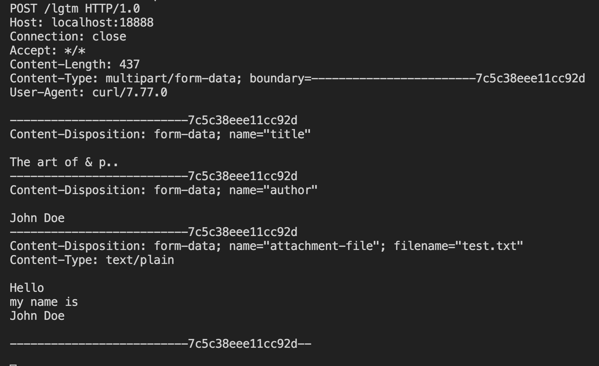

## sec 0
- [Microsoft REST API Guidelines](https://github.com/Microsoft/api-guidelines/blob/master/Guidelines.md)

## sec 1

### History
- RFCはIETFという組織が中心となって維持管理している、通信の相互接続性を維持するための共通化された仕様書集
- 通信プロトコルではなく、ファイルタイプの種類などの共通情報はIANAが管理

### HTTP0.9
0.9は現行のプロトコルと後方互換性がないため、まともには0.9のプロトコルを扱うことはできない

curl 

``` sh
curl --http1.0 http://localhost:18888/greeting
curl --http1.0 --get --data-urlencode "search world" http://localhost:18888
nslookup
```

### to 1.0
``` sh
curl -v --http1.0 http://localhost:18888/lgtm
curl --http1.0 -H "X-Test: Hi" http://localhost:18888/lgtm
```

0.9と比べて、以下が追加

- リクエスト
  - メソッド
  - HTTPバージョン
  - ヘッダー（Host, User-Agent, Accept）
- レスポンス
  - HTTPバージョン
  - 3桁のステータス
  - リクエストと同じ形式のヘッダー

### HTTPの先祖は電子メール！

HTTPの例
- リクエストヘッダー
  - User-Agent
  - Referer
  - Authorization
- Content-Type
  - MIMEタイプと呼ばれる識別子
    - MIMEタイプは電子メールのために作られた識別子
  - Content-Length
  - Content-Encoding
  - Date

ヘッダー（等？）の正規化の方法は特に指定されておらず、言語やフレームワークによっってことなる。

### MIMEタイプ（マイムタイプ）
ファイルの種類を区別するための文字列で、電子メールのために作られた。初出は1992。

Windowsは主にファイルの拡張子、Macはリソースフォークと呼ばれるメタ情報でファイルの種類を区別している。

『大項目/詳細』の形をしている。text/plain, image/jpeg などなど。

MIMEタイプのRFCはその後にも色々追加や更新があり、英語以外の多言語対応もこの延長線上に定義されている。image/svg+xml

意味が定義されていない単なるバイト列を表すMIMEタイプはapplication/octet-stream

IEはインターネットオプションによって、MIMEタイプではなく中身でファイルの種類を推測しようとする！この動作は Content Sniffing と呼ばれる。text/plain のつもりで送ったのに、HTMLとjsが書かれたために、ブラウザがそれを実行してしまうことがあった。
こうならないように、次のヘッダーを送信することで、ブラウザに推測を行わないよう指示できる

X-Content-Type-Options: nosniff

### HTTPの先祖はニュースグループ！
メソッドとステータスの２つの機能を導入。

curlでメソッドは、--request, or -X という形式を使う

``` sh
curl --http1.0 -X POST http://localhost:18888/lgtm
curl --http1.0 -X HEAD http://localhost:18888/lgtm
curl --http1.0 --head http://localhost:18888/lgtm
curl -v --http1.0 --head http://localhost:18888/lgtm
```

ステータスは、先頭３文字の数値を見てクライアントが動作を変更できるようにするべきもの！

### リダイレクト
Permanently 系のステータスでは、キャッシュをするようにしている。理にかなってそう。

リダイレクトはブラウザとの協調動作！サーバーはステータスとLocationヘッダーを返す。ブラウザはそれを見て、もう一度、ヘッダーで指定されたURLにリクエストし直している。

curlに-Lを付与すると、レスポンスが300番台でかつ、レスポンスヘッダーにLocationヘッダーがあった場合、そのヘッダーで指定されたURLに再度リクエストを送信する。

POSTでリダイレクトが返ってきた場合、GETで送信し直すケースもある、ということを覚えておくか。

1.1以降は、クライアントがリダイレクト無限ループを検知しなければならない。Go言語でのデフォルト設定でリダイレクトは10回に制限。

Googleのガイドラインでは、リダイレクトは5回以下、できれば3回以下、となっている。

アクセス先がディレクトリで末尾のスラッシュがない場合のリダイレクト、というものもある。

### URL (Uniform Resource Locators)
URIにはURN(Uniform Resource Name)という、名前の付け方のルールも含まれる。URLは住所、URNは名前そのもの。

Webを扱う限りURNが登場することはあまりないので、URLとURIはほぼ同一。その後の [RFC3305](https://datatracker.ietf.org/doc/html/rfc3305) でURLは慣用表現で、公式表記はURIということになったが、URLの方が一般的に広く使われている。

AWSのリソース名はURNを模して作られている。

URL
『スキーム://ホスト名/パス』

『スキーム://ユーザー:パスワード@ホスト名:ポート/パス?クエリー#フラグメント』

スキームを解釈するのはブラウザの仕事。ホスト名は大文字小文字を区別しない！へー。

フラグメントは、ページ内リンク先のアンカーを指定するもの。サーバーには送信されない。

### 正規URL
ほとんどのウェブサイトは www. を省略しても同じ内容が表示される。

Protocol-Relative URL と言って、スキームを省略して表記することもできる（例えば //example.com/image.png）。なるべく使わない方が良い。

### ボディ
0.9ではレスポンスはコンテンツそのものだったが、1.0ではリクエストとレスポンスにヘッダーが含まれるようになったため、ボディとヘッダーをきちんと分ける必要がある。

**ヘッダーとの間に空行を挟んで、それ以降が全てボディになる！**この構造は電子メールと全く同じ。

curl で送信時にボディを添付留守には、-d オプションを使う（--data）。

``` sh
# -d, --data, --data-ascii すでにエスケープされてる前提
# --data-urlencode, curl にエスケープしてもらう
# --data-binary, -T, -d @
curl --http1.0 -d "{\"hello\": \"world\"}" -H "Content-Type: application/json" http://localhost:18888/lgtm

```

リクエストボディはどのメソッドでも使えるが、推奨されていないメソッド（GETなど）もある。URLの文字数制限（約2000文字）を嫌ってあえて受け付けるように実装することもできるが、基本は避けるべき。


## sec 2

### フォームを使った body の送信
``` html
<form method="POST">
  <input name="title">
  <input name="author">
  <input type="submit">
</form>
```

これと同じ形式の送信は、以下のcurl

``` sh
# 以下の body は title=The art of..&author=John Doe
curl --http1.0 -d title="The art of.." -d author="John Doe" http://localhost:18888/lgtm

# 以下は RFC3986 での規格になる（パーセントエンコーディング）
curl --http1.0 --data-urlencode title="The art of & p.." -d author="John Doe" http://localhost:18888/lgtm
# 受信する内容
# title=The+art+of+%26+p..&author=John Doe
```

curl では、-d が渡されると、ブラウザと同じようにヘッダーとして、Content-Type: application/x-www-form-urlencoded を指定する！（ただし、エンコードされていないので厳密には違う）

ブラウザでは、[RFC1866](https://datatracker.ietf.org/doc/html/rfc1866#section-8.2.1)に則って変換される！（クエリパラメーターの場合はこの RFC1866）

### フォームでのファイルの送信
"multipart/form-data" をつけないと x-www-form-uelencoded と解釈され、ファイル名だけが送信される

``` html
<form action="POST" enctype="multipart/form-data">
</form>
```

一度のリクエストで複数のファイルを送信できるため、受け取りがわでファイルを区切る必要がある。そのため、送信時に、境界となる文字列をヘッダーに付与してあげている。

``` sh
curl --http1.0 -F title="The art of & p.." -F author="John Doe" -F attachment-file=@test.txt http://localhost:18888/lgtm
```

上記コマンドを打った場合に送信（サーバーに受信）される内容



-d と -F は混ぜることができない

### コンテントネゴシエーション
サーバーとクライアントで、通信の規格を揃えること

``` sh
# --compressed では「Accept-Encoding: deflate, gzip」
# というヘッダーが付与される
curl --http1.0 --compressed http://localhost:18888
```

### クッキー
HTTPのヘッダーをインフラとして実装されている。

curl
-c で指定したファイルに受信したクッキーを保存
-b で指定したファイルから読み込んでクッキーを送信する

``` sh
curl --http1.0 -b "name=value" http://localhost:18888
curl --http1.0 -c cooke.txt -b cookie.txt -b "name=value" http://localhost:18888
```

使用期間には、ブラウザを閉じたら消えてしまうセッションクッキーと、期限が設定されていてブラウザを閉じても残る永続クッキーの２種類がある。

### 制約
- Expires, Max-Age 属性
  - どちらかの指定がない場合、セッションクッキーとなる
- Domain 属性
  - クッキーを送信する対象のサーバー
- HttpOnly 属性
  - 悪意のある js が実行されるのを防ぐ
- SameSite 属性
  - RFC には存在しない
  - 同じオリジンのドメインに対して送信

クッキーの機能追加の歴史は、ウェブのセキュリティの歴史でもある。

「スキーム、ドメイン、ポート」の３つをまとめてオリジンと呼んでいる？

### 認証とセッション
`base64(ユーザー名 + ":" + パスワード)`の形でやりとりしている

curl で basic 認証

``` sh
# 「Authorization: Basic dXNlcjpwYXNz」というヘッダーが付与される
curl --http1.0 --basic -u user:pass http://localhost:18888/lgtm
# base64 <(echo -n user:pass)
# > dXNlcjpwYXNz
```

より安全な Digest 認証

なるほど、初回認証時に「nonce, algorithm, qop(保護レベル)」を送り、それをもとにハッシュ化したものを送ってもらう。nonce がランダム値。リトライ回数もわかる。

### プロキシ
- プロキシ
  - 通信内容を理解する。必要に応じてコンテンツを改変したり、サーバーの代わりに応答したりする
- ゲートウェイ
  - 通信内容をそのまま転送する。内容の改変も許さない。
  - クライアントからは存在すら気づかれてはならない！

### メモ
ウェブサイトへの機械的なアクセス時に、アクセス先に自分の身元を知らせるためにユーザーエージェントを使う流儀の人もいる。


## sec 3
client

### multipart POST
POST の第二引数の Content-Type には、以下の`FormDataContentType`を使う

``` go
// FormDataContentType returns the Content-Type for an HTTP
// multipart/form-data with this Writer's Boundary.
func (w *Writer) FormDataContentType() string {
	b := w.boundary
	// We must quote the boundary if it contains any of the
	// tspecials characters defined by RFC 2045, or space.
	if strings.ContainsAny(b, `()<>@,;:\"/[]?= `) {
		b = `"` + b + `"`
	}
	return "multipart/form-data; boundary=" + b
}
```


## 気になるところ

Content-Disposition のヘッダーの内容によって、ブラウザは表示するかダウンロードするかを選んでいる。

### 認証認可
- フェデレーテッドログイン
  - 自分のサービス以外が管理するIDを使ったログイン

### SAML（Security Assertion Markup Language）
SAMLはウェブ系の技術を前提としたシングルサインオンの仕組み。octa, Onelogin などSaaSで提供されているサービスもある。クッキーを使ってセッションを管理するウェブの仕組みに準じており、ドメインをまたいだサービス間でシングルサインオンできるようになっている。

- ユーザー
- 認証プロバイダー（IdP）
- サービスプロバイダー

### OAuth
OAuth は認証ではなく認可のための仕組み。

- 認可サーバー
- リソースサーバー
- クライアント

OpenIDが実現していることは、ユーザーが他のサービスで認証されていることを伝えることだけ。

### OpenID Connect
OAuth2.0 をベースにして、認可だけでなく、人称として使っても問題ないように拡張したもの。
ユーザー目線でのフローは、OpenID, OAuth と同じ。

アクセストークンとIDトークンを取得するために、２つのエンドポイントと、３つのフローを定義。

### WebRTC（Web Real-Time Communication）
ブラウザとブラウザのP2P通信でも使える！


### クロスサイトスクリプティング（XSS）
javascript を使った攻撃。

### クッキーの設定
httpOnly 属性をつけることで、JS からアクセスできないようにする。

### ヘッダー
Content-Security-Policy ヘッダーはウェブサイトで使える機能を細かくON／OFFできる強力な仕組み！ブラウザーが行う検査であり、サーバーではその情報を見ることはできない。

### クロスオリジンリソースシェアリング（CORS）
オリジン（ドメイン名）を跨いでリソースを共有する方法。リソース共有とは、XMLHttpRequestやFetch APIでのアクセスのこと。

守る対象はクライアントではなくAPIサーバー。許可してないウェブサイトからのアクセスを防ぐのが目的！

### クロスサイトクエストフォージェリ（CSRF）
本人が意図しないサーバーリクエストを、無関係のページやサイトから送らせること。

CSRFを防ぐ方法として、HTTPのステートレス性に制限を加える方法が利用される。フォームを設定する際に、隠しフィールドを作成しておきその値を送るようにする。

また、SameSite属性をつけることで、リクエストを送信する時のページが同一サイトにない限りはクッキーを送信しなくなる。


## curl
``` sh
curl --http1.0 http://localhost:18888/lgtm

curl -v --http1.0 http://localhost:18888/lgtm
curl --http1.0 -H "X-Test: Hi" http://localhost:18888/lgtm
curl --http1.0 -H "User-Agent: Mozilla/5.0 (compatible; MSIE 10.0; Windows NT 6.1; Trident/6.0)" http://localhost:18888/lgtm

curl --http1.0 -X HEAD http://localhost:18888/lgtm
curl --http1.0 --head http://localhost:18888/lgtm

curl -L http://localhost:18888

curl --http1.0 --data-urlencode title="The art of & p.." -d author="John Doe" http://localhost:18888/lgtm

curl --http1.0 -F title="The art of & p.." -F author="John Doe" -F attachment-file=@test.txt http://localhost:18888/lgtm
```
