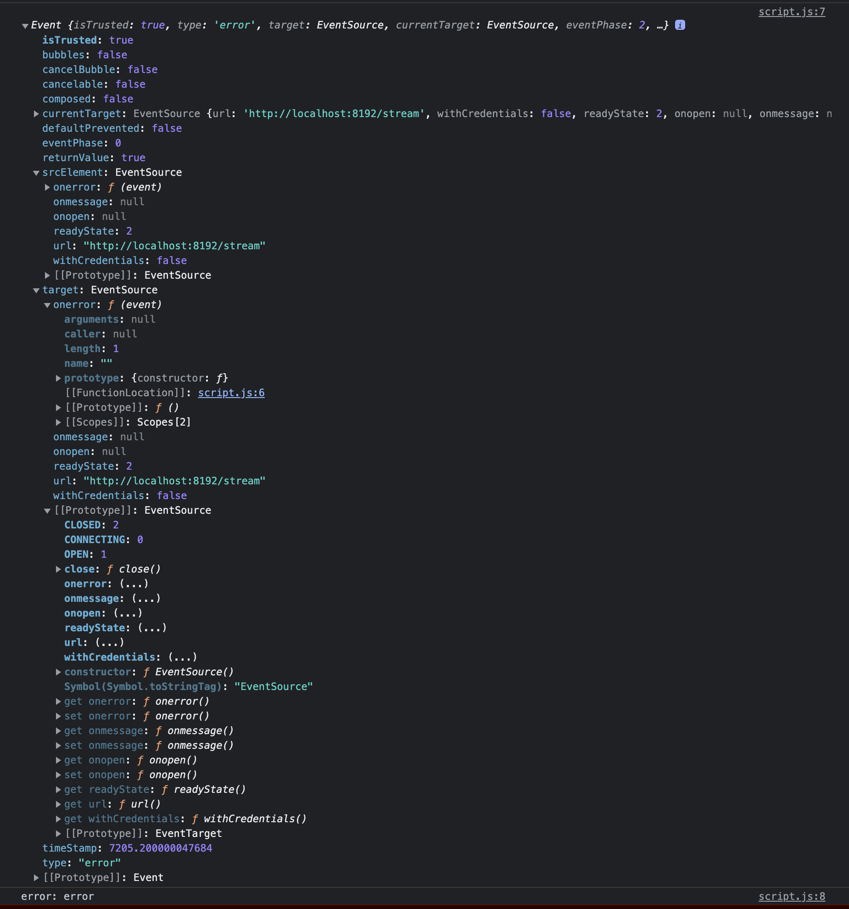

## websocket 接続してサーバーしてサーバー側を切断したとき

onerror のコールバックが呼ばれる、その時の Event 情報は以下　

また、この時開発者ツールでの Status は 200 ではなく failed になっている。

### [mdm: error event](https://developer.mozilla.org/ja/docs/Web/API/EventSource/error_event)

readyState

### [イベントストリームを閉じる](https://developer.mozilla.org/ja/docs/Web/API/Server-sent_events/Using_server-sent_events#%E3%82%A4%E3%83%99%E3%83%B3%E3%83%88%E3%82%B9%E3%83%88%E3%83%AA%E3%83%BC%E3%83%A0%E3%82%92%E9%96%89%E3%81%98%E3%82%8B)

> 既定では、クライアントとサーバーの間の接続を閉じると、接続が再起動します。
> 接続は .close() メソッドで終了します。

